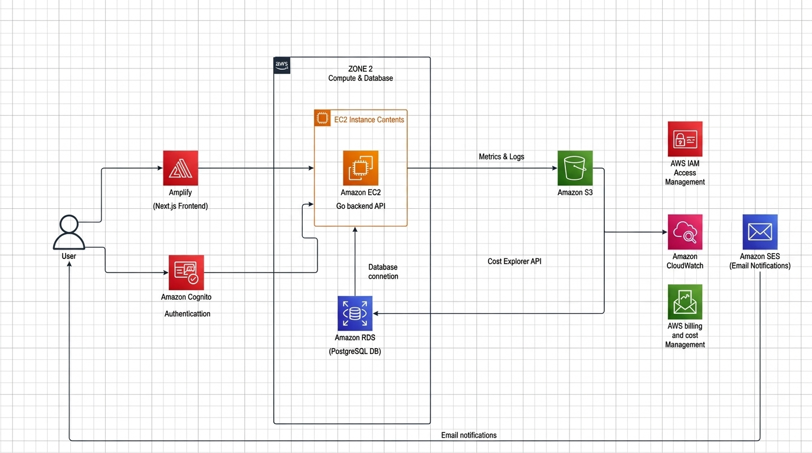
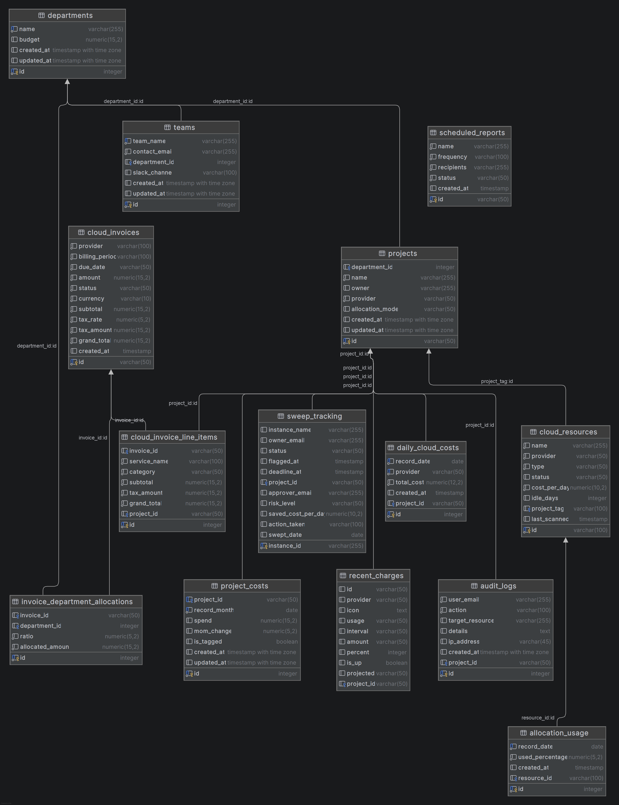

# ☁️ Simple Cloud Lifecycle — FinOps Dashboard

Centralized Cloud Financial Management (FinOps) dashboard for monitoring, analyzing, and managing AWS cloud infrastructure costs with automated resource lifecycle controls.

[](https://go.dev/)
[](https://nextjs.org/)
[](https://www.postgresql.org/)
[](https://www.terraform.io/)
[](https://aws.amazon.com/)
[](https://docs.docker.com/compose/)

---

## 📌 About the Project

**Simple Cloud Lifecycle** is a FinOps dashboard built to help developers and finance teams track cloud spend in one place. It integrates with AWS Cost Explorer, monitors active EC2 instances, and includes a **Resource Sweeper** feature to flag and terminate unused/idle resources to prevent unexpected billing.

---

## ✨ Key Features

| Feature | Description |
|---------|-------------|
| 📊 **Dashboard Stats** | MTD spend, budget usage %, active resources, and cost anomaly alerts |
| 💰 **Cost Allocation** | Spend breakdown by project, team, and department |
| 🔍 **Resource Sweeper** | Scan and terminate idle EC2 instances with email & Slack alerts |
| 📈 **Reports & Analytics** | Cost trend charts, ROI/NPV metrics, and export features |
| 🛡️ **Budget Governance** | Set budget limits per department and get alert notifications |
| 🖥️ **Resource Control** | Start, stop, and manage EC2 instances directly from the dashboard |
| 📧 **Invoice Management** | Upload billing invoices/receipts directly to Amazon S3 |
| ⚡ **Performance Metrics** | View CPU, Memory, and Disk usage via CloudWatch integration |
| 🔐 **Role-Based Auth** | User authentication and role permissions using Amazon Cognito (JWT) |

---

## 🏗️ Cloud Architecture



```text
Internet Users
     │ HTTPS
     ▼
Application Load Balancer  (Port 80/443)
     ├── /* ──────────────► Next.js Frontend  (:3000)
     └── /api/* ──────────► Go Backend API    (:8000)
                              │
                    ┌─────────┴───────┬───────────────┐
                    ▼                 ▼               ▼
             RDS PostgreSQL     Amazon S3       AWS Cost Explorer
              (Private DB)     (Reports)       (Billing Data)
                 
      Auth: Amazon Cognito (JWT)
      Secrets: AWS Secrets Manager
      Email: Amazon SES
      Notifications: Slack Webhooks
      Monitoring: CloudWatch + SNS
      Governance: Cloud Custodian
```

---

## 🗄️ Database Schema (ER Diagram)

Entity Relationship Diagram for PostgreSQL tracking teams, budgets, projects, cloud invoices, resource allocations, and sweeper logs.



---

## 🛠️ Tech Stack

- **Frontend:** Next.js 15, TypeScript, Tailwind CSS, Material UI, Recharts
- **Backend:** Go 1.24 (Golang), REST API, AWS SDK v2
- **Database:** PostgreSQL 16 (AWS RDS)
- **Auth:** Amazon Cognito (JWT Auth & Groups)
- **Infra & DevOps:** AWS (ap-southeast-1), Terraform, Docker Compose, ALB, Auto Scaling Group

---

## 📂 Project Structure

```text
simple-cloud-lifecycle/
├── frontend/             # Next.js web app (UI & Dashboards)
│   ├── app/              # Next.js App Router
│   ├── components/       # UI Components (Charts, Tables, Modals)
│   ├── lib/              # Auth & Service helpers
│   └── types/            # TypeScript type definitions
├── backend/              # Go RESTful API
│   ├── cmd/api/          # Entry point (main.go)
│   └── internal/         # Core business logic
│       ├── handlers/     # API endpoints
│       ├── middleware/   # JWT Auth & Role checks
│       ├── models/       # Structs & DB models
│       └── services/     # AWS SDK, Cost, Sweeper, Email logic
├── AWS/                  # Terraform IaC
│   ├── main.tf           # ALB & Core setup
│   ├── networking.tf     # VPC, Subnets & Security Groups
│   ├── ec2.tf            # ASG & Launch Templates
│   ├── rds.tf            # RDS PostgreSQL setup
│   └── custodian_policy.yml # Cloud Custodian idle-stop policy
└── docs/                 # Documentation & diagrams
```

---

##  Estimated Infrastructure Cost (Infracost)

Estimated monthly cost on **AWS (ap-southeast-1)** provisioned via Terraform:

| AWS Resource / Component | Spec / Configuration | Monthly Cost (USD) |
|--------------------------|----------------------|--------------------|
| **RDS PostgreSQL 16 (`aws_db_instance.main`)** | `db.t3.micro` (730 hrs) + 20 GB gp3 SSD | $23.20 |
| **Application Load Balancer (`aws_lb.main`)** | ALB (730 hrs) | $18.40 |
| **EC2 Auto Scaling (`aws_autoscaling_group.app`)** | `t3.micro` (730 hrs) + 30 GB gp3 SSD | $12.52 |
| **CloudWatch Dashboard (`finops`)** | 1 FinOps Dashboard | $3.00 |
| **AWS Secrets Manager** | 1 Secret (`backend_secrets`) | $0.40 |
| **CloudWatch Alarms & Metrics** | Standard Metric Alarms | $0.10 |
| **Total Estimated Monthly Cost** | Generated by **Infracost CLI** | **~$57.62 / month** |

> Report generated directly via **Infracost CLI** (`AWS/infracost-report.html`).

---

## 🚀 Getting Started

### Prerequisites

Make sure you have installed:
- **Node.js** (v18+)
- **Go** (1.24+)
- **Docker & Docker Compose** (or local PostgreSQL)

### 1. Clone the repository

```bash
git clone https://github.com/optravc/simple-cloud-lifecycle.git
cd simple-cloud-lifecycle
```

### 2. Run with Docker Compose

```bash
docker-compose up --build
```

- **Frontend:** http://localhost:3000
- **Backend API:** http://localhost:8080

### 3. Run Manually

**Frontend:**
```bash
cd frontend
npm install
npm run dev
```

**Backend:**
```bash
cd backend
go mod download
go run cmd/api/main.go
```